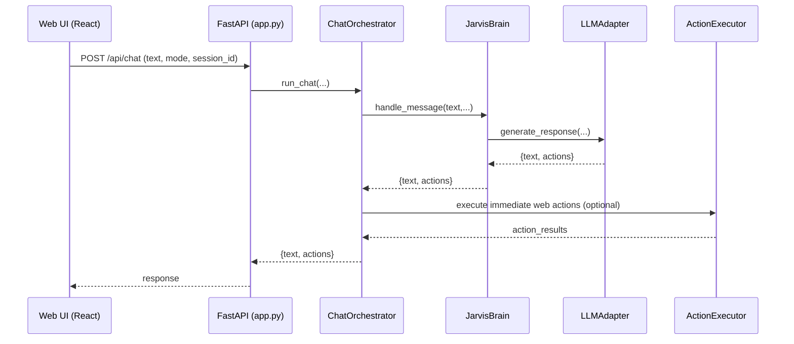
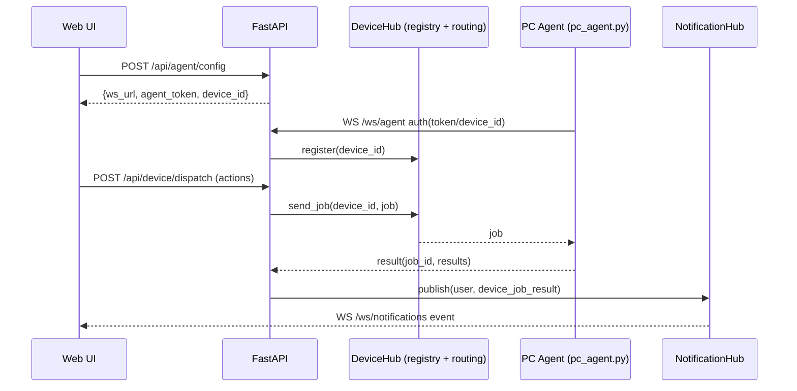

# Jarvis Cloud Assistant — Architecture & Working Flow

Last updated: 2026-03-11

This document is the **single high-level reference** for how the system is built (technology stack), how it runs (working flow), and where the core business logic lives. It is written to be readable by humans *and* AI agents doing maintenance.

## 1) Technology Stack (What’s Used)

### Backend (Python)
- **FastAPI** HTTP API + WebSockets: entrypoint is `apps/web/app.py` (legacy alias: `app.py`)
- **Uvicorn** ASGI server for local/dev and production
- **Pydantic** request/response models
- **MongoDB (pymongo)** primary DB (with graceful “DB-down” behavior)
- **Redis (optional)** shared broker for multi-instance routing (notifications + agent job routing)
- **APScheduler** optional background tasks (session cleanup and other jobs)
- **HTTP clients**: `aiohttp`, `httpx`, `requests`

### LLM Providers
- **OpenAI-compatible Chat Completions API** via `src/core/llm_adapter.py`
  - Primary defaults: model `gpt-5.2`, endpoint `https://api.openai.com/v1/chat/completions`
  - Backup defaults: Groq OpenAI-compatible endpoint

### Frontend (Web UI)
- **React (CRA)** in `jarvis-frontend/`
- Uses browser **Web Speech**, mic recording + optional cloud STT path
- Talks to backend through `jarvis-frontend/src/utils/api.js`
- Receives server push events via WebSocket `/ws/notifications`
- Autonomous control surfaces are implemented in:
  - `jarvis-frontend/src/pages/AutonomyDashboard.jsx`
  - `jarvis-frontend/src/pages/TaskManager.jsx`
  - `jarvis-frontend/src/pages/AgentMonitor.jsx`
  - `jarvis-frontend/src/pages/ResearchMonitor.jsx`
  - `jarvis-frontend/src/pages/DeviceControl.jsx`
  - `jarvis-frontend/src/pages/SystemHealth.jsx`
  - `jarvis-frontend/src/pages/SelfImprovementPanel.jsx`
- Visualization stack for autonomy UI:
  - `reactflow` for task graph rendering
  - `chart.js` + `react-chartjs-2` for runtime metrics

### Companion “PC Agent” (Remote device actions)
- `apps/pc_agent/pc_agent.py` (legacy alias: `pc_agent.py`): runs on a user-owned machine, connects to server WebSocket `/ws/agent`
- Strict permission model (local persistent permissions file) and sandboxed file ops
- Optional packaged Windows UI wrapper: `apps/pc_agent/pc_agent_app.py` (legacy alias: `pc_agent_app.py`) (+ `assets/pc_agent_ui.html`)

### Packaging / Desktop
- PyInstaller specs:
  - `JarvisDesktop.spec`: packages desktop app from `apps/desktop/desktop_app.py` and embeds frontend build
  - `JarvisPCAgent.spec`: packages PC agent UI app

Desktop app implementation update (2026-02-23):
- The desktop runtime has been consolidated into a single implementation:
  - `apps/desktop/desktop_app.py`
- Legacy launch files remain as compatibility wrappers only:
  - `apps/desktop/jarvis_web_shell.py`
  - `apps/desktop/jarvis_desktop.py`
- Build automation for latest desktop package:
  - `scripts/build_desktop_app.py`
  - `build_desktop_app.bat`
  - This flow rebuilds frontend production assets and then runs PyInstaller, so each build includes the latest code.

Desktop startup readiness update (2026-03-11):
- Desktop backend probe now checks `/health` (canonical route) with `/api/health` fallback.
- This resolved false startup failures where backend was running but desktop showed:
  - `Backend not ready at http://127.0.0.1:18001`

### MCP (Optional)
- Separate MCP server under `mcp_server/` (FastAPI + MCP tool registrations)

---

## 2) Runtime Modes (How It Behaves)

There are two key modes that affect **safety, allowed actions, and auth**:

### Local / Desktop mode
- Default for local runs via `run_local.py` (sets safe overrides)
- Uses permissive defaults for developer convenience (e.g., can auto-generate JWT secret for pairing)
- Some features may be disabled depending on packaging and flags

### Cloud / Hosted mode
- Enabled either by environment markers (Render/Heroku/Docker detection) in `src/config/runtime_defaults.py` or explicitly via env `JARVIS_CLOUD_MODE`
- **Requires authentication for chat** to prevent public abuse/cost
- **Disables local/PC control and filesystem writes** on the server-side executor
- Device actions are meant to be executed by the **PC agent** (user machine), not the cloud server

Important toggles in `apps/web/app.py` (legacy alias: `app.py`):
- `JARVIS_CLOUD_MODE` (bool)
- `JARVIS_VOICE_ONLY` (bool)
- `JARVIS_ENABLE_PC_AGENT` (bool)

---

## 3) High-Level Components (Who Does What)

### `apps/web/app.py` (legacy alias: `app.py`) (API surface + composition)
- Creates FastAPI app, wires dependencies:
  - `LLMAdapter`, `JarvisBrain`, `ActionExecutor`, `ChatOrchestrator`
  - `DeviceHub` (agent registry + routing; Redis-backed when configured)
  - `NotificationHub` (in-process pub/sub; Redis-backed fanout when configured)
- Implements routes:
  - Chat: `POST /api/chat` (+ alias `POST /api/message`)
  - Health: `GET /health`
  - Autonomy: `GET /api/autonomy/status`, `GET/POST /api/autonomy/goals`
  - Task/agent views: `GET /api/tasks`, `GET /api/agents`
  - Notifications WS: `WS /ws/notifications`
  - PC agent WS: `WS /ws/agent`
  - Device binding + dispatch: `/api/user/device/*`, `/api/device/dispatch`, `GET /api/device/list`
  - Self-improvement review: `GET /api/self-improvement/proposals`, `POST /api/self-improvement/proposals/decision`
  - Skills: `/api/skills/*`
  - Voice/auth/telegram/admin endpoints (see code)

### `src/core/jarvis_brain.py` (Conversation brain)
- Maintains short-term memory and “operational mode”
- Handles some deterministic intents (e.g., skill add/enable/disable, language setting)
- Calls `LLMAdapter.generate_response(...)` for general responses and structured `actions`
- Persists learning examples (RAG-lite) to MongoDB when enabled

### `src/core/llm_adapter.py` (Provider + prompt shaping)
- Single choke point for OpenAI-compatible calls (`_call_openai`)
- Routes to smart model if configured (complexity heuristic)
- Loads “skills catalog” (MongoDB preferred, fallback `data/skills.json`) and injects into prompt
- Dedupe/filter actions, normalizes app names, etc.

### `src/core/chat_orchestrator.py` (Pipeline / policy)
- Orchestrates the message flow without adding routes:
  1) Ask the brain for text + actions
  2) Apply policy filters (role-based, cloud restrictions, explicit screenshot guard)
  3) Execute immediate web actions inline (2-pass web pipeline)
  4) Schedule deferred actions in background
  5) Supports async “research jobs” (web_search → fetch_url → synthesize) with cancellation polling

### `src/core/executor.py` (Action execution)
- Executes the `actions` emitted by the brain
- Enforces **cloud-mode restrictions** (forbids local/PC/file/self-modifying actions)
- Provides web tools (`web_search`, `fetch_url`), n8n webhook calls, and local tools when allowed

### `pc_agent.py` (Remote executor on user PC)
- Connects to `/ws/agent`
- Receives jobs (`{job_id, actions, ...}`), executes allowed actions locally
- Maintains a strict allowlist/sandbox:
  - Allowed roots are under `PROJECT_ROOT` and `ALLOWED_ROOTS`
  - Blocked dirs/files (e.g., `.env`, `.git`, `node_modules`, keys)
  - Dangerous commands are rejected
- Permissions:
  - `allow_execute_command`, `allow_app_control`, `allow_screen`, `allow_self_update`, `allow_file_ops`
  - Can be persisted and auto-applied by server on reconnect

---

## 4) Core Working Flows (End-to-End)

### A) Web UI chat (normal)
1) UI calls `POST /api/chat` with `{text, mode, session_id}`
2) `app.py` validates session (JWT preferred in cloud)
3) `ChatOrchestrator.run_chat(...)` returns `{text, actions}`
4) Local mode: executor may run actions directly
5) Cloud mode: only a small set of “safe server actions” is executed server-side; the rest is returned to the UI for device dispatch

Mermaid (simplified):

### B) “Research” (web_search + optional fetch + synthesize)
- Triggered when user text looks like research/analysis request.
- Orchestrator may run a background research job and publish progress/results through `NotificationHub`.
- Results are also persisted via `TaskManager` so clients can fetch even if they miss the WS push.

### C) Remote device actions (Cloud → PC)
1) UI obtains agent config via `POST /api/agent/config` (server issues a JWT agent token)
2) PC agent connects to `WS /ws/agent` and authenticates (token preferred, shared secret fallback)
3) UI asks backend to dispatch actions: `POST /api/device/dispatch`
4) Server validates user role + device ownership, checks agent capabilities, then sends a job over `DeviceHub.send_job`
5) PC agent executes and sends `{type: 'result', job_id, results}` back over WS
6) Server forwards a summarized payload to user via `WS /ws/notifications` (best-effort)

Mermaid:

---

## 5) Business Logic (Rules & Policies)

### Authentication and roles
- Cloud mode requires JWT sessions (`JARVIS_JWT_SECRET` must be set in cloud)
- Roles: `user` or `admin`
- Role can come from:
  - JWT payload, but can be overridden by the user store (`voice_auth.get_user`) so role changes apply immediately

### Action policy (important safety model)
- **Admin-only action types** are defined in `app.py` (`ADMIN_ONLY_ACTION_TYPES`)
- Cloud-mode execution restrictions are enforced in `src/core/executor.py`
- Screenshot guard: capture actions are filtered unless the user explicitly asks

### PC agent permissions (explicit user consent)
- Server persists per-device permissions and can auto-apply on agent reconnect.
- PC agent also persists permissions locally (file) for resilience.

### Skills (n8n webhooks)
- Skills are stored in MongoDB collection `skills` (preferred)
- Fallback catalog exists in `data/skills.json`
- The LLM is prompted with “Available skills (call via n8n_webhook)” so it can emit `n8n_webhook` actions

### Tasks / background operations
- `src/utils/task_manager.py` stores task state in MongoDB (`tasks` collection) when available
- In cloud mode, MongoDB is required for task persistence (state survives restarts)
- File-backed tasks (`data/tasks.json`) are a local-only opt-in (`JARVIS_TASK_STORE=file`)

---

## 6) Data & Persistence (Where State Lives)

### MongoDB (preferred when available)
- Core collections created/indexed in `src/utils/db.py` include:
  - `chat_history`, `system_events`, `voice_commands`, `module_changes`, `git_operations`
  - `learning_examples` (RAG-lite)
  - `web_training_data`
  - (also used elsewhere): `skills`, `user_preferences`, device registry/permissions collections

### Local filesystem (fallback / lightweight state)
- `data/tasks.json`: local-only task persistence (opt-in; not used by default)
- `data/skills.json`: skills fallback catalog
- `data/sessions/active_sessions.json`: session persistence for legacy sessions
- `data/agent_permissions.json`: default/permitted actions for a local PC agent setup (and/or packaging defaults)

---

## 7) Key Files (Index for Fast Navigation)

Entry points:
- `apps/web/app.py` (legacy alias: `app.py`) — backend server
- `run_local.py` — local backend run wrapper
- `apps/pc_agent/pc_agent.py` (legacy alias: `pc_agent.py`) — PC agent runtime
- `apps/desktop/desktop_app.py` — desktop runtime entrypoint
- `build_desktop_app.bat` and `scripts/build_desktop_app.py` — desktop build pipeline
- `run_pc_agent.py` — PC agent launcher wrapper

Core pipeline:
- `src/core/chat_orchestrator.py`
- `src/core/jarvis_brain.py`
- `src/core/llm_adapter.py`
- `src/core/executor.py`

Auth/session:
- `src/utils/auth_tokens.py` (JWT)
- `src/utils/session_manager.py` (legacy file-based sessions)
- `src/api/session_routes.py` (session route composition extracted from `apps/web/app.py`)

Frontend:
- `jarvis-frontend/src/utils/api.js` (all API + WS URLs)
- `jarvis-frontend/src/App.jsx` (main UI behavior)
- `jarvis-frontend/src/components/HUDLogs.jsx` (structured message rendering: text/plan/task_graph/code_block/research_report)
- `jarvis-frontend/src/pages/AutonomyDashboard.jsx` (tabbed autonomy console)
- `jarvis-frontend/src/pages/SelfImprovementPanel.jsx` (approve/reject/diff flow)

PC agent UI / packaging:
- `apps/pc_agent/pc_agent_app.py` (legacy alias: `pc_agent_app.py`), `assets/pc_agent_ui.html`
- `JarvisDesktop.spec`, `JarvisPCAgent.spec`

Desktop app:
- `apps/desktop/desktop_app.py` — canonical desktop app implementation
- `apps/desktop/jarvis_web_shell.py` — compatibility launcher
- `apps/desktop/jarvis_desktop.py` — compatibility launcher

---

## 8) Operating Principles (So Updates Don’t Break Things)

1) **Keep policy in one place**
   - Auth/role enforcement belongs at the HTTP layer (`app.py` / orchestrator policy), not scattered in executors.

2) **Cloud mode must remain non-destructive**
   - Never execute local-device or filesystem writes in cloud server executor.

3) **Action types are a contract**
   - If you add/change an action type, update:
     - LLM prompting/parsing (usually `src/core/llm_adapter.py`)
     - Server executor (`src/core/executor.py`) if server-side
  - PC agent (`apps/pc_agent/pc_agent.py`, legacy alias: `pc_agent.py`) if it’s a device action
     - UI dispatch/permission handling if needed (`jarvis-frontend/src/utils/api.js`, PermissionModal)

4) **Prefer MongoDB, but degrade gracefully**
   - Many paths are written to keep the app usable when DB is down.

---

## 9) Change Log (keep it short)
- 2026-02-06: Initial architecture + working-flow documentation created.
- 2026-02-23: Replaced legacy multi-implementation desktop app with a unified `desktop_app.py` runtime and kept old desktop entrypoints as wrappers for backward compatibility.
- 2026-02-23: Updated `JarvisDesktop.spec` to package `desktop_app.py` directly and added one-command desktop builder scripts (`scripts/build_desktop_app.py`, `build_desktop_app.bat`).
- 2026-03-11: Added autonomy dashboard pages, task graph + metrics visualization, and structured chat message rendering for plan/task/research/code output types.
- 2026-03-11: Added API surfaces for device list and self-improvement proposal review/decision.
- 2026-03-11: Fixed desktop backend readiness probe to use `/health` (with fallback), resolving false "Backend not ready" startup errors.
